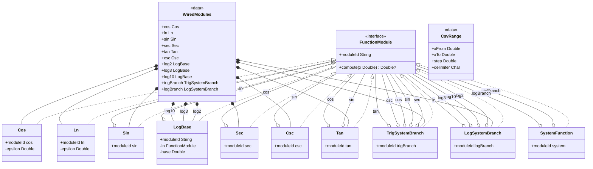
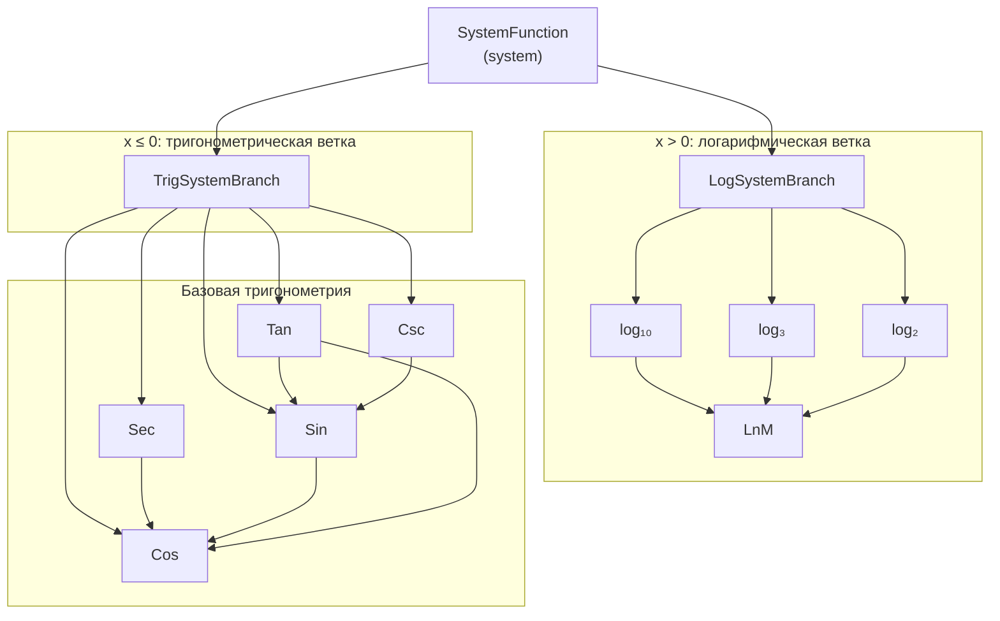

### UML диаграмма классов

```mermaid
classDiagram
  direction TB

  class FunctionModule {
    <<interface>>
    +moduleId String
    +compute(x Double) Double?
  }

  class Cos {
    +moduleId cos
    -epsilon Double
  }

  class Ln {
    +moduleId ln
    -epsilon Double
  }

  class Sin {
    +moduleId sin
  }

  class Sec {
    +moduleId sec
  }

  class Tan {
    +moduleId tan
  }

  class Csc {
    +moduleId csc
  }

  class LogBase {
    +moduleId String
    -ln FunctionModule
    -base Double
  }

  class TrigSystemBranch {
    +moduleId trigBranch
  }

  class LogSystemBranch {
    +moduleId logBranch
  }

  class SystemFunction {
    +moduleId system
  }

  class WiredModules {
    <<data>>
    +cos Cos
    +ln Ln
    +sin Sin
    +sec Sec
    +tan Tan
    +csc Csc
    +log2 LogBase
    +log3 LogBase
    +log10 LogBase
    +trigBranch TrigSystemBranch
    +logBranch LogSystemBranch
  }

  class CsvRange {
    <<data>>
    +xFrom Double
    +xTo Double
    +step Double
    +delimiter Char
  }

  FunctionModule <|.. Cos
  FunctionModule <|.. Ln
  FunctionModule <|.. Sin
  FunctionModule <|.. Sec
  FunctionModule <|.. Tan
  FunctionModule <|.. Csc
  FunctionModule <|.. LogBase
  FunctionModule <|.. TrigSystemBranch
  FunctionModule <|.. LogSystemBranch
  FunctionModule <|.. SystemFunction

  Sin o-- FunctionModule : cos
  Sec o-- FunctionModule : cos
  Tan o-- FunctionModule : sin
  Tan o-- FunctionModule : cos
  Csc o-- FunctionModule : sin
  LogBase o-- FunctionModule : ln

  TrigSystemBranch o-- FunctionModule : sec
  TrigSystemBranch o-- FunctionModule : sin
  TrigSystemBranch o-- FunctionModule : cos
  TrigSystemBranch o-- FunctionModule : csc
  TrigSystemBranch o-- FunctionModule : tan

  LogSystemBranch o-- FunctionModule : log2
  LogSystemBranch o-- FunctionModule : log10
  LogSystemBranch o-- FunctionModule : log3
  LogSystemBranch o-- FunctionModule : ln

  SystemFunction o-- FunctionModule : trigBranch
  SystemFunction o-- FunctionModule : logBranch

  WiredModules *-- Cos
  WiredModules *-- Ln
  WiredModules *-- Sin
  WiredModules *-- Sec
  WiredModules *-- Tan
  WiredModules *-- Csc
  WiredModules *-- LogBase : log2
  WiredModules *-- LogBase : log3
  WiredModules *-- LogBase : log10
  WiredModules *-- TrigSystemBranch
  WiredModules *-- LogSystemBranch
```

### Диаграмма композиции функций

```mermaid
flowchart TB
  SF["SystemFunction<br/>(system)"]

  subgraph le0["x ≤ 0: тригонометрическая ветка"]
    TSB[TrigSystemBranch]
  end

  subgraph gt0["x > 0: логарифмическая ветка"]
    LSB[LogSystemBranch]
    LSB -->  L3["log₃"]
    LSB --> l2["log₂"]
    LSB --> l10["log₁₀"] --> LnM
    L3 --> LnM
    l2 --> LnM
  end

  subgraph basicsTrig["Базовая тригонометрия"]
    CosM[Cos]
    SinM[Sin]
    SecM[Sec]
    TanM[Tan]
    CscM[Csc]
  end

  SF --> TSB
  SF --> LSB

  TSB --> SecM
  TSB --> SinM
  TSB --> CosM
  TSB --> CscM
  TSB --> TanM

  SecM --> CosM
  SinM --> CosM
  TanM --> SinM
  TanM --> CosM
  CscM --> SinM
```

